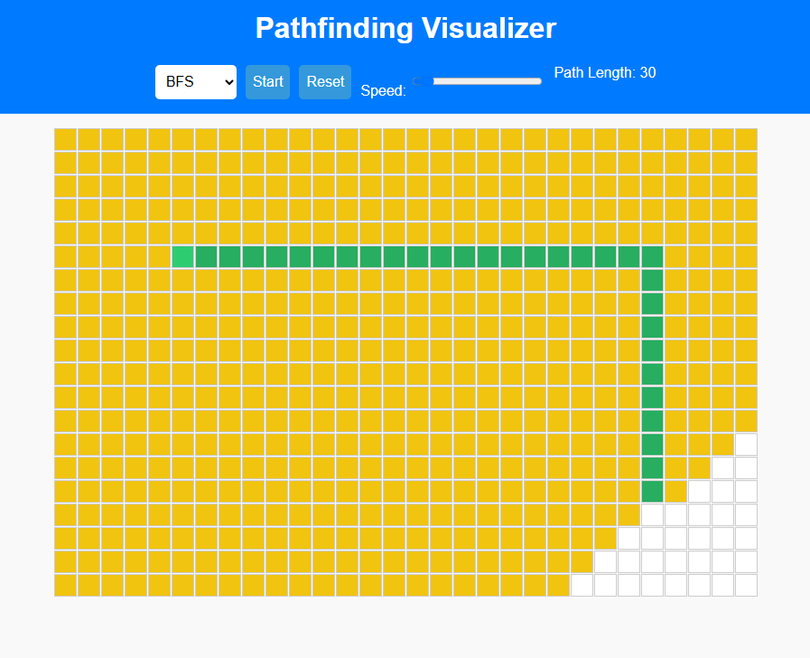

An interactive and animated pathfinding algorithm visualizer built with HTML, CSS, and JavaScript. Users can create custom walls, move start and end points, and watch popular pathfinding algorithms in action — step-by-step. 

---

--- 
🚀 Live Demo
🌐 Live Demo🔗 : https://abhishektps4.github.io/pathfinder/
---

🔁 Multiple Algorithms
Visualize:

Breadth-First Search (BFS)

Depth-First Search (DFS)

Dijkstra’s Algorithm

A* Search Algorithm
---

🎯 Interactive Grid

Click and drag to draw walls.

Move the start and end nodes by dragging.

Responsive to user input.

⏱️ Adjustable Speed

Control the animation speed via a slider.

📏 Path Length Display

Shows the number of steps in the shortest path found. 
---

/pathfinder-visualizer
├── index.html         # Main UI layout
├── styles.css         # Grid and visual styling
├── script.js          # All pathfinding logic and grid interactivity
└── README.md 
---

MIT License
© 2025 Abhishek Raj
